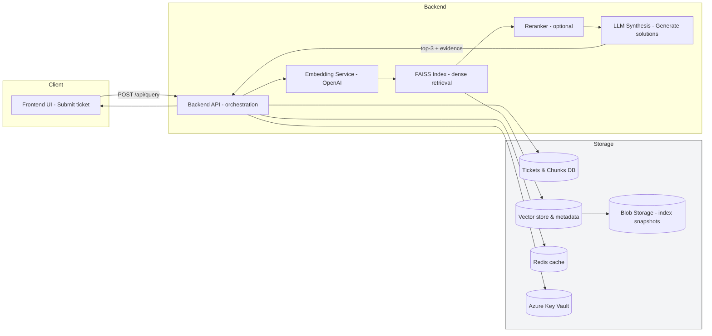

# GenAI-Powered Ticket Analysis for Telecom

## Objective
Build a Generative-AI assistant that analyzes incoming telecom support tickets and returns the top-3 recommended solutions with suitability percentages. The assistant should surface supporting resolved tickets as evidence, scale to large corpora using FAISS, use OpenAI for embeddings and generation, and be deployable to Azure.

## Key Features
- Ingest and preprocess telecom support tickets (network, billing, activation, etc.)
- Create embeddings with OpenAI and store vectors in FAISS
- Two-stage retrieval: FAISS dense search -> optional reranker -> LLM synthesis
- Web UI to accept ticket descriptions and display top-3 solutions with provenance
- Deployment-ready architecture for Azure with secure key management

## High-level Architecture
1. Data ingestion & preprocessing (chunking, PII redaction, dedup)
2. Embedding & vector store (OpenAI embeddings -> FAISS)
3. Backend API (embed queries, run FAISS search, assemble context, call LLM)
4. Frontend UI (submit ticket, display solutions + evidence)
5. Monitoring, evaluation and CI (metrics: P@3, MRR, latency, calibration)

### Architecture diagram (Mermaid)

The diagram below is written in Mermaid so GitHub will render it directly in the README. If your viewer doesn't render Mermaid, consider adding a PNG/SVG export alongside this README.



## Data model (essentials)
- Ticket: `{ ticket_id, original_text, category, resolved, resolution_text, created_at, metadata }`
- Chunk/Vector metadata: `{ vector_id, ticket_id, chunk_id, chunk_text, token_count }`

## Sample dataset

A small sample dataset is included in the repo for local testing and demos: `data/sample_tickets.json`.

Example record fields:

- `ticket_id` — integer
- `category` — string (e.g., "network", "billing")
- `customer_issue_description` — free-text description
- `root_cause` — short diagnosis
- `final_resolution` — resolution summary

Use this file to prototype ingestion, chunking and indexing flows. To load it in a Node/Python script, parse the JSON at `data/sample_tickets.json` and follow your existing ingestion pipeline.

## Ingestion & Chunking
- Clean and redact PII.
- Chunk length: ~500 tokens with 50–100 token overlap.
- Batch embeddings for throughput; deduplicate identical chunks.

## Embeddings & FAISS
- Embedding model: OpenAI `text-embedding-3-small` (cost-effective) or `-large` for quality.
- Small corpora: IndexFlatIP (exact cosine search). Normalize embeddings.
- Medium/large: use IVF+PQ (IndexIVFPQ or IndexIVFFlat) and tune `nlist/m`.
- Persist index to disk and snapshot to Azure Blob Storage.

## Query Flow & API (concept)
- POST `/api/query`
  - Request: `{ ticket_text, top_k?, category? }`
  - Server: embed -> FAISS.search(top_k=50) -> rerank(top_10) -> assemble top snippets -> call LLM -> parse JSON -> respond
  - Response: `{ solutions: [{id,text,steps,impact,suitability_percent,evidence_ids}], evidence: [...], timings: {...} }`

## Prompting & LLM guidelines
- Use deterministic settings: `temperature` 0.0–0.1.
- Provide system role: expert telecom assistant; require strict JSON output.
- Supply only top 3–5 snippets to limit token usage.
- Optionally run a short validation/critic pass to normalize suitability percentages.

## Explainability & Provenance
- Include `evidence` array with `{ ticket_id, snippet, similarity_score, resolution_excerpt }`.
- Frontend should display evidence panel per solution and link to original ticket.
- If similarity < threshold (e.g., 0.12), return a safe fallback: "No similar resolved tickets found — escalate." 

## Accuracy & Evaluation
- Ground truth: use resolved tickets as automatic GT (query=description, gold=resoluton/ticket_id).
- Metrics: P@1, P@3, MRR, NDCG@3, Brier score and ECE for suitability calibration, human-rated usefulness.
- Create `tools/generate_predictions.py` and `tools/evaluate.py` to automate evaluation (recommended in Python).
- Maintain an evaluation set (dev/test) and run nightly CI checks to detect drift.

## Scalability & Operations
- Two-stage retrieval reduces LLM calls and cost: FAISS -> reranker -> LLM.
- For large indexes, use IVFPQ and shard indexes across nodes or use GPU FAISS.
- Cache common queries/embeddings in Redis.
- Monitor memory, p95 latency, and throughput; autoscale search replicas (AKS or App Service for Containers).

## Security & Privacy
- Store OpenAI keys and DB credentials in Azure Key Vault.
- Call OpenAI only from server-side; never expose keys to frontend.
- Redact or anonymize PII at ingestion; use field-level encryption for sensitive fields.

## Azure Deployment 
- Frontend: Azure Static Web Apps or App Service
- Backend + FAISS: Docker container on Azure App Service for Containers, Azure Container Instances, or AKS
- DB: Azure Cosmos DB (Mongo API) or Azure Database for PostgreSQL
- Index snapshots: Azure Blob Storage
- Secrets: Azure Key Vault
- Monitoring: Azure Application Insights

## Quick Local Dev Steps (example)
1. Set env vars: `OPENAI_API_KEY`, DB connection, `AZURE_*` if using Azure.
2. Index a small sample:
```bash
node scripts/index_dataset.js --input data/kaggle_sample.csv --batch 128
```
3. Run backend (docker recommended):
```bash
docker build -t ticket-ai-backend:dev .
docker run -e OPENAI_API_KEY="$OPENAI_API_KEY" -p 3000:3000 ticket-ai-backend:dev
```
4. Run frontend and test queries.

## Evaluation & CI
- Automate `tools/generate_predictions.py` to call `/api/query` for a fixed test set.
- Run `tools/evaluate.py` to compute P@k, MRR, calibration, and produce `results_summary.csv`.
- Add nightly GitHub Actions to run evaluation and fail if metrics drop below thresholds.

## Next steps 
1. Create a small evaluation set and run baseline retrieval+LLM to get initial metrics.
2. Implement evidence UI and define annotation guideline for human verification.
3. Add monitoring (App Insights) and CI evaluation job.
4. Optionally implement a local cross-encoder reranker (sentence-transformers) for better ranking.

## References & Artifacts to include in repo
- `scripts/index_dataset.js` — ingestion + chunking + embedding
- `backend/` — API server, FAISS search service
- `frontend/` — simple React/Next.js UI
- `tools/generate_predictions.py` and `tools/evaluate.py` — evaluation harness
- `design.md` — detailed design and prompt templates


Practical notes

- Keep secrets out of Git: use a local `.env` for development and Azure Key Vault in production.
- Exclude large binaries (FAISS indexes) from Git; keep small index manifests under `data/processed/` and push full snapshots to Azure Blob Storage.
- Centralize all FAISS reads/writes in `backend/src/faiss_service.js` so other backend modules call a simple interface.


